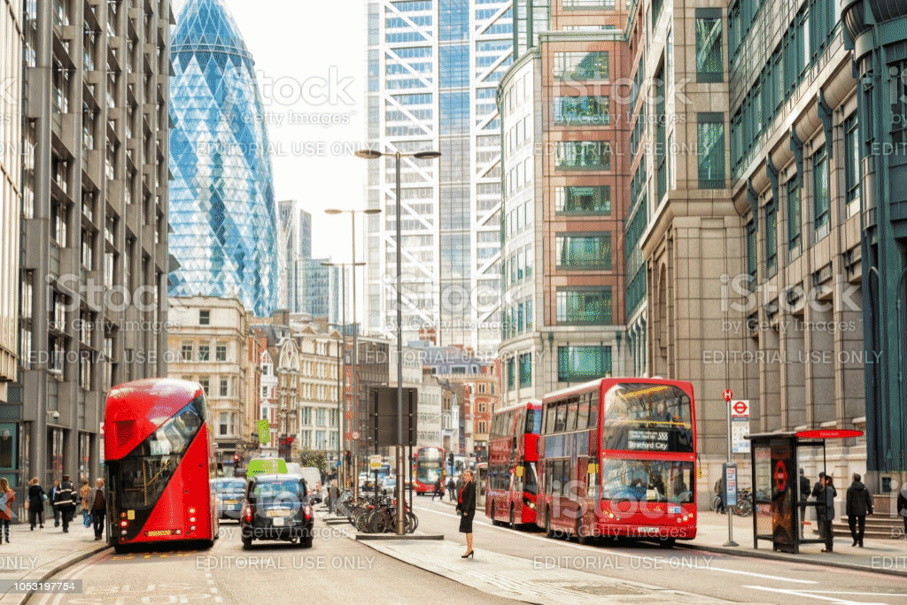

# Combining segmentation and Inpainting

A project in Image Segmentation and Inpainting.
Extension of [LaMa Paper](https://arxiv.org/pdf/2109.07161.pdf), [LaMa Github](https://github.com/saic-mdal/lama).


In this project we aim to augment the paper [LaMa](https://arxiv.org/pdf/2109.07161.pdf). In the original paper the input consists of a pair of high resolution image and a binary mask. We propose to auto-generate the input masks using a segmentation neural network and thus making the task fully automated.

Written by [George Pisha](https://github.com/geopi1) and [Men Yevgeniy](https://github.com/yevgm).


## Getting Started

Clone the Repo:  
```bash
git clone https://github.com/yevgm/Combining-segmentation-and-Inpainting
```

### Test Dataset
Download the Test Dataset

The following links will download the data folders:
* [Test Dataset](https://technionmail-my.sharepoint.com/:f:/g/personal/yevgenimen_campus_technion_ac_il/EgcLsH8iZFZMpYWK3NuHdboB0ozBGOxYRrjRbgaljAfeng?e=E9clb7) - Contains test dataset for three classes (dog, bus , person) and their manual segmentaton masks, automatic segmentation masks and the output

### Prerequisites
Tested and ran on:  
 * UBUNTU 18.04  
 * RTX 2080  
 * Nvidia driver 440.95.10  
 * cuda 10.1.243  
 * cudnn 7.6.5  
 * pytorch 1.5  
 * TF 1.14  
for additional package information please refer to requirements.txt or env.yml 
 
 
1. Setup conda 
    ```bash
    conda env create -f env.yml
    ```
    This will create a working environment named Blind_USRNet
2. Setup can also be performed with pip (virtual env) via the requirements.txt file 
    ```bash
    python -m venv Blind_USRNet
    pip install -r requirements.txt
    ```
3. There are several examples provided with the code in ./input_images
4. All other images to be tested should be placed in ./input_images

## Running the Code
### Code
  ```
  % 1. Print avaliable classes to remove from an image
  python ./main.py -a print_cls
  
  % 2. Run the inpainting pipeline
  % -c to choose the class integer
  % -i to provide full path to the images
  % ./test_images is the path of model input
  python ./main.py -a inpaint -c 15 -i $(pwd)/test_images
  ```
After running the inpainting command (2), two directories will be created:
* input - which will include the original images alongside their semantic segmentation mask
* output - which will include the inpainted images


### Numerical Evaluation
To calculate the numerical results on the whole dataset run:
1. Download the test images from the link above
```bash
python src/segmentation_comparison.py -t ../../test_data_comparison
```
Which will calculate the LPIPS distance for every class between the original image and the inpainted image, for semantic segmentation mode (auto) and manual mask generation.

## Numerical Results
| Class        | Manual        | Segmentation |
| ------------- | -------------- | -------------------- | 
| dog          | 0.1261      | 0.1314     |
| bus          | 0.1013      | 0.1018     |
| person          | 0.1626      | 0.1584     |


## Visual Results
Bla Bla
Example 1:   
  
Example 2:  
  
Example 3:  
  

## License

This project is licensed under the MIT License - see the [LICENSE.md](LICENSE.md) file for details

## References
1. LaMa : "Resolution-robust Large Mask Inpainting with Fourier Convolutions" - [arxiv](https://arxiv.org/pdf/2109.07161.pdf) 
2. LPIPS : "The Unreasonable Effectiveness of Deep Features as a Perceptual Metric" - [arxiv](https://arxiv.org/pdf/1801.03924.pdf)
