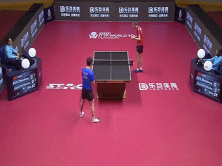
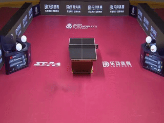

# Combining segmentation and Inpainting

A project in Image Segmentation and Inpainting.
Extension of [LaMa Paper](https://arxiv.org/pdf/2109.07161.pdf), [LaMa Github](https://github.com/saic-mdal/lama).


In this project we aim to augment the [LaMa](https://arxiv.org/pdf/2109.07161.pdf) project. In the original paper the input consists of a pair of high resolution image and a binary mask. We propose to auto-generate the input masks using a segmentation neural network and thus making the task fully automated.

In our Project we use [DeepLabV3 model](https://pytorch.org/hub/pytorch_vision_deeplabv3_resnet101/) to segment the images. The pre-trained model has been trained on a subset of COCO train2017, on the 20 categories that are present in the Pascal VOC dataset.

Written by [George Pisha](https://github.com/geopi1) and [Men Yevgeniy](https://github.com/yevgm).


## Getting Started

Clone the Repo:  
```bash
git clone https://github.com/yevgm/Combining-segmentation-and-Inpainting
```

### Test Dataset

The following links will download the data folders:
* [Test Dataset](https://technionmail-my.sharepoint.com/:f:/g/personal/yevgenimen_campus_technion_ac_il/EgcLsH8iZFZMpYWK3NuHdboB0ozBGOxYRrjRbgaljAfeng?e=E9clb7) - Contains test dataset for three classes (dog, bus, person) and their manual segmentaton masks, automatic segmentation masks and the output
* [LaMa fourier model](https://technionmail-my.sharepoint.com/:f:/r/personal/yevgenimen_campus_technion_ac_il/Documents/lama-fourier?csf=1&web=1&e=Y5RFtg) - Pretrained LaMa model (same as the original)

### Prerequisites

1. Setup conda 
    ```bash
    conda env create -f env.yml
    ```
    This will create a working environment named Blind_USRNet
2. Setup can also be performed with pip (virtual env) via the requirements.txt file 
    ```bash
    python -m venv Blind_USRNet
    pip install -r requirements.txt
    ```
3. Test images and pretrained models can be downloaded via the links above

## Running the Code
1. To run the inpainting pipeline run command 2
     * -c to choose the class integer. CHOSEN_CLASS can be chosen via command 1
     * -i to provide full path to the images
     * ./test_images is the path of model input
     * --lama-model-path is the lama-fourier pretrained model path
     * --lama-model-name is the filename of the model
### Print Classes to Select
  ```
  % 1. Print avaliable classes to remove from an image
  python ./main.py -a print_cls
  ```
### Run Auto-Inpainting Code
  ```
  % 2. Run the inpainting pipeline
  python ./main.py -a inpaint -c CHOSEN_CLASS -i $(pwd)/test_images --lama-model-path $(pwd)/lama-fourier --lama-model-name best.ckpt
  ```
  
After running the inpainting command (2), two directories will be created:
* input - which will include the original images alongside their semantic segmentation mask
* output - which will include the inpainted images


### Numerical Evaluation
To calculate the numerical results on the whole dataset run:
1. Download the test images from the link above
2. Run the following command
```bash
python src/segmentation_comparison.py -t ../../test_data_comparison
```
Which will calculate the LPIPS distance for every class between the original image and the inpainted image, for semantic segmentation mode (auto) and manual mask generation.

## Numerical Results
| Class        | Manual (LPIPS)        | Segmentation (LPIPS) |
| ------------- | -------------- | -------------------- | 
| dog          | 0.1261      | 0.1314     |
| bus          | 0.1013      | 0.1018     |
| person          | 0.1626      | 0.1584     |


## Visual Results
Bla Bla
Example 1:   
  
Example 2:  
  
Example 3:  


## Extending to Video
We also extend [LaMa](https://github.com/saic-mdal/lama) to video, by building a pipeline to feed videos.
Additionally, to improve temporal consistency we also add an optional training step.
This step is using internal learning and the Deep Image Prior concept to create video temporal consistency.
```bash
python ./main.py -a inpaint -c CHOSEN_CLASS -i $(pwd)/test_images --lama-model-path $(pwd)/lama-fourier --lama-model-name best.ckpt
```

Then run
```bash
python ./src/video_seg/train.py -i ./video_imgs 
```

### Video Results - Original

### Video Results - Post Processed



## License

This project is licensed under the MIT License - see the [LICENSE.md](LICENSE.md) file for details

## References
1. LaMa : [Resolution-robust Large Mask Inpainting with Fourier Convolutions](https://arxiv.org/pdf/2109.07161.pdf) 
2. LPIPS : [The Unreasonable Effectiveness of Deep Features as a Perceptual Metric](https://arxiv.org/pdf/1801.03924.pdf)
3. DeepLabV3 : [Rethinking Atrous Convolution for Semantic Image Segmentation](https://arxiv.org/pdf/1706.05587.pdf)
